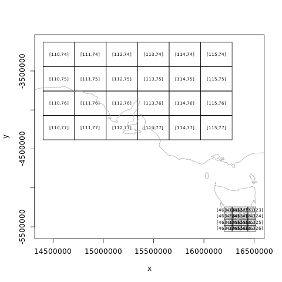

<!-- README.md is generated from README.Rmd. Please edit that file -->

  [](https://www.tidyverse.org/lifecycle/#maturing)[](https://travis-ci.org/hypertidy/ceramic) [](https://ci.appveyor.com/project/mdsumner/ceramic)  [](https://codecov.io/github/hypertidy/ceramic?branch=master) [](https://cran.r-project.org/package=ceramic)[](https://cran.r-project.org/package=ceramic)

  

```{r setup, include = FALSE}
knitr::opts_chunk$set(
  collapse = TRUE,
  comment = "#>",
  fig.path = "man/figures/README-",
  out.width = "100%"
)
```
# ceramic

The goal of ceramic is to obtain web map tiles. Use a spatial object to define the region of interest. 


```{r}
library(ceramic)
roi <- raster::extent(100, 160, -50, 10)
im <- cc_location(roi)

raster::plotRGB(im)
```


We can use raster, sp, or sf objects to define an extent. This provides a very easy way to obtain imagery or elevation data for any almost any region using our own data. 

```{r extent2, fig.width=8, fig.height=10}
ne <- rnaturalearth::ne_countries(returnclass = "sf")
im_nz <- cc_location(subset(ne, name == "New Zealand"), 
                     type = "mapbox.light")
raster::plotRGB(im_nz)
```

Even if the data uses a map projection it will be converted into a region to match the Mercator extents used by Mapbox image servers. 

```{r nz-spData}
data("nz", package = "spData")
library(sf)
im_nz2 <- cc_location(nz)
raster::plotRGB(im_nz2)
plot(st_transform(nz, raster::projection(im_nz2)), add = TRUE, col = rainbow(nrow(nz), alpha = 0.5))
```

There are basic heuristics to decide if data is projected or just in "longitude,latitude" in the usual raster package way. 

Raster elevation data is also available. 

```{r}
north <- nz[nz$Island == "North", ]
dem_nz <- cc_elevation(north)


## plot elevation data for NZ north
dem_nz[!dem_nz > 0] <- NA
raster::plot(dem_nz, col = grey(seq(0, 1, length = 51)), breaks = quantile(raster::values(dem_nz), seq(0, 1, length = 52), na.rm = TRUE), legend = FALSE)
plot(st_transform(st_cast(north, "MULTILINESTRING")["Name"], raster::projection(dem_nz)), add = TRUE, lwd = 5)

```

## I thought you said *tiles*?

Indeed, the `cc_location()` and `cc_elevation()` functions run `get_tiles()` behind the scenes. 

This function and its counterparts `get_tiles_zoom()`, `get_tiles_dim()` and `get_tiles_buffer()` will *only download
files*. 

```{r tiles}
tile_summ <- get_tiles_zoom(north, zoom = 8)
length(tile_summ$files)
str(tile_summ$tiles)
```

This is really for expert use when you want to control the downloaded tile files yourself directly. 


## Providers

The default map provider is [Mapbox](https://www.mapbox.com/), but ceramic is written for general usage and also provides access to the [joerd AWS tiles](https://github.com/tilezen/joerd/) via the `type = "elevation-tiles-prod"` argument. 

```{r}
pt <- cbind(175.6082, -37.994)
nz_z12 <- cc_location(pt, zoom = 12, type = "elevation-tiles-prod")
```

```{r, eval=FALSE, include = FALSE}
north_carolina <- sf::read_sf(system.file("gpkg/nc.gpkg", package = "sf", mustWork = TRUE))
nc_image <- cc_location(north_carolina)

rowan_dem <- cc_elevation(dplyr::filter(north_carolina, NAME == "Rowan"))
nc_contour <- raster::rasterToContour(raster::focal(cc_elevation(north_carolina), matrix(1, 3, 3)), levels = pretty(values(rowan_dem)))
```

```{r, eval=FALSE, include = FALSE}
op <- par(mfrow = c(2, 1))
raster::plotRGB(nc_image)
plot(nc_contour, add = TRUE, col = "white")
plot(raster::extent(rowan_dem), add = TRUE, col = "firebrick", lwd = 3)
plot(rowan_dem, col = grey(seq(0, 1, length = 26)), add = TRUE, legend = FALSE)
plot(rowan_dem, col = grey(seq(0, 1, length = 26)), add = TRUE, legend = FALSE)
box(col= "white")
par(op)
```

Use `max_tiles` or `zoom` to increase or decrease resolution. 

```{r, max-tiles}
im1 <- cc_location(im_nz, debug = TRUE)
im2 <- cc_location(im_nz, zoom = 7)

im1

im2
```


## Installation

Install ceramic from CRAN with: 

```R
install.packages("ceramic")
```

You can install the development version of ceramic from  Github. 

```R
## install.packages("remotes")
remotes::install_github("hypertidy/ceramic")
```

Set your mapbox API key with 

```R
Sys.setenv(MAPBOX_API_KEY = "<yourkey>")
```

## Example

This complete example gets tiled imagery that we can use as real data. 

The code here

* generates a bounding box in longitude-latitude
* uses [slippymath](https://CRAN.r-project.org/package=slippymath) to find sensible tiles for the region
* downloads them to a local cache
* georeferences them and merges the tiles into a sensible raster object

```{r example}
library(ceramic)
## a point in longlat, and a buffer with in metres
pt <- cbind(136, -34)
im <- cc_location(pt, buffer = c(1e6, 5e5), type = "mapbox.satellite")
library(raster)
plotRGB(im)

## get the matching tiles (zoom is magic here, it's all wrapped - needs thought)

tiles <- ceramic_tiles(zoom = 6, type = "mapbox.satellite")
library(sf)
plot(st_geometry(ceramic:::tiles_to_polygon(tiles)), add = TRUE)
middle <- function(x, y) {
  x + (y - x)/2
}
text(middle(tiles$xmin, tiles$xmax), middle(tiles$ymin, tiles$ymax), lab = sprintf("[%i,%i]", tiles$tile_x, tiles$tile_y), 
     col = "firebrick")
```


## Local caching of tiles

A key feature of ceramic is *caching*, all data is downloaded in a systematic way that is suitable for later re-use. Many tools for imagery services treat the imagery as transient, but here we take control over the raw data itself. All file names match exactly the address URL of the original source data. 

There is a helper function to find existing tiles. 

```{r files}
aa <- cc_location(loc = cbind(0, 0), buffer = 330000, type = "mapbox.satellite")
ceramic_tiles(zoom = 7, type = "mapbox.satellite")
```

and every row has the extent values useable directly by raster: 

```{r extent}
ceramic_tiles(zoom = 7, type = "mapbox.satellite") %>% 
  dplyr::slice(1:5) %>% 
   purrr::transpose()  %>% 
  purrr::map(~raster::extent(unlist(.x[c("xmin", "xmax", "ymin", "ymax")])))
```


Another example

```{r tasmania}
my_bbox <-
  st_bbox(c(xmin = 144,
            xmax = 147.99,
            ymin = -44.12,
            ymax = -40),
          crs = st_crs("+proj=longlat +ellps=WGS84"))
im <- cc_location(cbind(145.5, -42.2), buffer = 5e5)
plotRGB(im)
plot(st_transform(ozmaps::abs_lga$geometry, projection(im)), add = TRUE, lwd = 2, border = "white")
```

An internal function sets up a plot of tiles at particular zoom levels. 

```R
ceramic::plot_tiles(ceramic_tiles(zoom = c(7, 9)))
```



And we can add the tiles to an existing plot. 

```R
plotRGB(im)
ceramic::plot_tiles(ceramic_tiles(zoom = 7), add = TRUE)
```


# Future improvements


See the [Issue tab](https://github.com/hypertidy/ceramic/issues/) and please make suggestions and give feedback!

---

Please note that the 'ceramic' project is released with a [Contributor Code of Conduct](https://github.com/hypertidy/ceramic/blob/master/CODE_OF_CONDUCT.md). By contributing to this project, you agree to abide by its terms.


