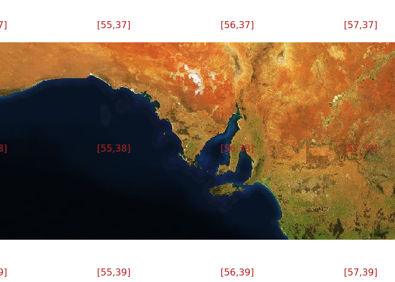
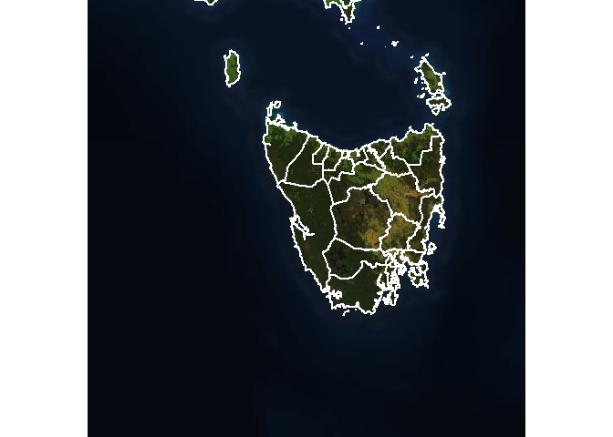

<!-- README.md is generated from README.Rmd. Please edit that file -->

[](https://www.tidyverse.org/lifecycle/#maturing)[](https://travis-ci.org/hypertidy/ceramic)
[](https://ci.appveyor.com/project/mdsumner/ceramic)
[](https://codecov.io/github/hypertidy/ceramic?branch=master)
[](https://cran.r-project.org/package=ceramic)[](https://cran.r-project.org/package=ceramic)

# ceramic

The goal of ceramic is to obtain web map tiles. Use a spatial object to
define the region of interest.

``` r
library(ceramic)
roi <- raster::extent(100, 160, -50, 10)
im <- cc_location(roi)
#> Preparing to download: 16 tiles at zoom = 4 from 
#> https://api.mapbox.com/v4/mapbox.satellite/

raster::plotRGB(im)
```


We can use raster, sp, or sf objects to define an extent. This provides
a very easy way to obtain imagery or elevation data for any almost any
region using our own data.

``` r
data("wrld_simpl", package = "maptools")
im_nz <- cc_location(subset(wrld_simpl, NAME == "New Zealand"), 
                     type = "mapbox.light")
#> Preparing to download: 16 tiles at zoom = 3 from 
#> https://api.mapbox.com/v4/mapbox.light/
raster::plotRGB(im_nz)
```


Even if the data uses a map projection it will be converted into a
region to match the Mercator extents used by Mapbox image servers.

``` r
options(warn = -1)
```

There are basic heuristics to decide if data is projected or just in
“longitude,latitude” in the usual raster package way.

Raster elevation data is also available.

``` r
north <- nz[nz$Island == "North", ]
dem_nz <- cc_location(north, type = "elevation-tiles-prod" )
#> [1] "dark magic"
#> Preparing to download: 15 tiles at zoom = 7 from 
#> https://s3.amazonaws.com/elevation-tiles-prod/geotiff/


## plot elevation data for NZ north
dem_nz[!dem_nz > 0] <- NA
raster::plot(dem_nz, col = grey(seq(0, 1, length = 51)), breaks = quantile(raster::values(dem_nz), seq(0, 1, length = 52), na.rm = TRUE), legend = FALSE)
plot(st_transform(st_cast(north, "MULTILINESTRING")["Name"], raster::projection(dem_nz)), add = TRUE, lwd = 5)
```


## I thought you said *tiles*?

Indeed, the `cc_location()` and `cc_elevation()` functions run
`get_tiles()` behind the scenes.

This function and its counterparts `get_tiles_zoom()`, `get_tiles_dim()`
and `get_tiles_buffer()` will *only download files*.

``` r
tile_summ <- get_tiles_zoom(north, zoom = 8)
#> [1] "dark magic"
#> Preparing to download: 48 tiles at zoom = 8 from 
#> https://api.mapbox.com/v4/mapbox.satellite/
length(tile_summ$files)
#> [1] 48
str(tile_summ$tiles)
#> List of 2
#>  $ tiles:'data.frame':   48 obs. of  2 variables:
#>   ..$ x: int [1:48] 250 251 252 253 254 255 250 251 252 253 ...
#>   ..$ y: int [1:48] 153 153 153 153 153 153 154 154 154 154 ...
#>   ..- attr(*, "out.attrs")=List of 2
#>   .. ..$ dim     : Named int [1:2] 6 8
#>   .. .. ..- attr(*, "names")= chr [1:2] "x" "y"
#>   .. ..$ dimnames:List of 2
#>   .. .. ..$ x: chr [1:6] "x=250" "x=251" "x=252" "x=253" ...
#>   .. .. ..$ y: chr [1:8] "y=153" "y=154" "y=155" "y=156" ...
#>  $ zoom : num 8
#>  - attr(*, "class")= chr "tile_grid"
```

This is really for expert use when you want to control the downloaded
tile files yourself directly.

## Providers

The default map provider is [Mapbox](https://www.mapbox.com/), but
ceramic is written for general usage and also provides access to the
[joerd AWS tiles](https://github.com/tilezen/joerd/) via the `type =
"elevation-tiles-prod"` argument.

``` r
pt <- cbind(175.6082, -37.994)
nz_z12 <- cc_location(pt, zoom = 12, type = "elevation-tiles-prod")
#> Preparing to download: 4 tiles at zoom = 12 from 
#> https://s3.amazonaws.com/elevation-tiles-prod/geotiff/
```

Use `max_tiles` or `zoom` to increase or decrease resolution.

``` r
im1 <- cc_location(im_nz, debug = TRUE)
#> Preparing to download: 16 tiles at zoom = 3 from 
#> https://api.mapbox.com/v4/mapbox.satellite/
#> [1] "C:\\Users\\michae_sum\\AppData\\Local\\Cache/.ceramic/api.mapbox.com/v4/mapbox.satellite/3/0/4.jpg"
#> [1] "C:\\Users\\michae_sum\\AppData\\Local\\Cache/.ceramic/api.mapbox.com/v4/mapbox.satellite/3/1/4.jpg"
#> [1] "C:\\Users\\michae_sum\\AppData\\Local\\Cache/.ceramic/api.mapbox.com/v4/mapbox.satellite/3/2/4.jpg"
#> [1] "C:\\Users\\michae_sum\\AppData\\Local\\Cache/.ceramic/api.mapbox.com/v4/mapbox.satellite/3/3/4.jpg"
#> [1] "C:\\Users\\michae_sum\\AppData\\Local\\Cache/.ceramic/api.mapbox.com/v4/mapbox.satellite/3/4/4.jpg"
#> [1] "C:\\Users\\michae_sum\\AppData\\Local\\Cache/.ceramic/api.mapbox.com/v4/mapbox.satellite/3/5/4.jpg"
#> [1] "C:\\Users\\michae_sum\\AppData\\Local\\Cache/.ceramic/api.mapbox.com/v4/mapbox.satellite/3/6/4.jpg"
#> [1] "C:\\Users\\michae_sum\\AppData\\Local\\Cache/.ceramic/api.mapbox.com/v4/mapbox.satellite/3/7/4.jpg"
#> [1] "C:\\Users\\michae_sum\\AppData\\Local\\Cache/.ceramic/api.mapbox.com/v4/mapbox.satellite/3/0/5.jpg"
#> [1] "C:\\Users\\michae_sum\\AppData\\Local\\Cache/.ceramic/api.mapbox.com/v4/mapbox.satellite/3/1/5.jpg"
#> [1] "C:\\Users\\michae_sum\\AppData\\Local\\Cache/.ceramic/api.mapbox.com/v4/mapbox.satellite/3/2/5.jpg"
#> [1] "C:\\Users\\michae_sum\\AppData\\Local\\Cache/.ceramic/api.mapbox.com/v4/mapbox.satellite/3/3/5.jpg"
#> [1] "C:\\Users\\michae_sum\\AppData\\Local\\Cache/.ceramic/api.mapbox.com/v4/mapbox.satellite/3/4/5.jpg"
#> [1] "C:\\Users\\michae_sum\\AppData\\Local\\Cache/.ceramic/api.mapbox.com/v4/mapbox.satellite/3/5/5.jpg"
#> [1] "C:\\Users\\michae_sum\\AppData\\Local\\Cache/.ceramic/api.mapbox.com/v4/mapbox.satellite/3/6/5.jpg"
#> [1] "C:\\Users\\michae_sum\\AppData\\Local\\Cache/.ceramic/api.mapbox.com/v4/mapbox.satellite/3/7/5.jpg"
im2 <- cc_location(im_nz, zoom = 7)
#> Preparing to download: 1536 tiles at zoom = 7 from 
#> https://api.mapbox.com/v4/mapbox.satellite/

im1
#> NULL

im2
#> class      : RasterBrick 
#> dimensions : 2881, 32577, 93854337, 3  (nrow, ncol, ncell, nlayers)
#> resolution : 1222.992, 1222.992  (x, y)
#> extent     : -19900533, 19940892, -6752141, -3228700  (xmin, xmax, ymin, ymax)
#> crs        : +proj=merc +lon_0=0 +k=1 +x_0=0 +y_0=0 +R=6378137 +units=m +no_defs 
#> source     : C:/Users/michae_sum/AppData/Local/Temp/Rtmp6lWq1n/raster/r_tmp_2020-05-16_012925_9364_97374.grd 
#> names      : layer.1, layer.2, layer.3 
#> min values :       0,       0,       0 
#> max values :     255,     255,     255
```

## Installation

Install ceramic from CRAN with:

``` r
install.packages("ceramic")
```

You can install the development version of ceramic from Github.

``` r
## install.packages("remotes")
remotes::install_github("hypertidy/ceramic")
```

Set your mapbox API key with

``` r
Sys.setenv(MAPBOX_API_KEY = "<yourkey>")
```

## Example

This complete example gets tiled imagery that we can use as real data.

The code here

  - generates a bounding box in longitude-latitude
  - uses [slippymath](https://CRAN.r-project.org/package=slippymath) to
    find sensible tiles for the region
  - downloads them to a local cache
  - georeferences them and merges the tiles into a sensible raster
    object

<!-- end list -->

``` r
library(ceramic)
## a point in longlat, and a buffer with in metres
pt <- cbind(136, -34)
im <- cc_location(pt, buffer = c(1e6, 5e5), type = "mapbox.satellite")
#> Preparing to download: 12 tiles at zoom = 6 from 
#> https://api.mapbox.com/v4/mapbox.satellite/
library(raster)
#> Loading required package: sp
plotRGB(im)

## get the matching tiles (zoom is magic here, it's all wrapped - needs thought)

tiles <- ceramic_tiles(zoom = 6, type = "mapbox.satellite")
library(sf)
plot(st_geometry(ceramic:::tiles_to_polygon(tiles)), add = TRUE)
middle <- function(x, y) {
  x + (y - x)/2
}
text(middle(tiles$xmin, tiles$xmax), middle(tiles$ymin, tiles$ymax), lab = sprintf("[%i,%i]", tiles$tile_x, tiles$tile_y), 
     col = "firebrick")
```



## Get imagery and DEM for use in 3D visualization

This code downloads a specific region as elevation and imagery at
specific zoom levels to build [a 3D
scene](https://hypertidy.github.io/anglr-demos/ceramic-demo01.html).

``` r
library(ceramic); library(quadmesh)
library(raster); library(rgl);
library(reproj); library(htmlwidgets)
clear3d()

## longlat extent
ex0 <- c(147.15, 147.45, -42.9, -42.6)
ex <- extent(ex0)

## local LAEA projection, based on the centre of the extent
prj <- sprintf("+proj=laea +lon_0=%f +lat_0=% +datum=WGS84", mean(ex0[1:2]), mean(ex0[3:4]))
## Mapbox elevation
dem <- cc_elevation(ex, zoom = 8)
## Mapbox satellite imagery
im <- cc_location(ex, zoom = 13)

## quadmesh with texture for rgl, in local projection
qm <- reproj::reproj(quadmesh(dem, texture = im), prj)

## plot with rgl, set the aspect ratio and backround
shade3d(qm, lit = FALSE);
aspect3d(1, 1, .1)
bg3d(grey(0.8))
```

The zoom levels were chosen by first reading an automatic level for the
extents, and then tweaking the zoom - higher resolution for the imagery,
lower resolution for the elevation. This provides a compelling
visualization in 3D as the imagery is *textured* onto the elevation
data, using rgl’s `mesh3d` type and `shade3d()` function.

## Local caching of tiles

A key feature of ceramic is *caching*, all data is downloaded in a
systematic way that is suitable for later re-use. Many tools for imagery
services treat the imagery as transient, but here we take control over
the raw data itself. All file names match exactly the address URL of the
original source data.

There is a helper function to find existing tiles.

``` r
aa <- cc_location(loc = cbind(0, 0), buffer = 330000, type = "mapbox.satellite")
#> Preparing to download: 16 tiles at zoom = 7 from 
#> https://api.mapbox.com/v4/mapbox.satellite/
ceramic_tiles(zoom = 7, type = "mapbox.satellite")
#> # A tibble: 1,651 x 11
#>    tile_x tile_y  zoom type  version source fullname      xmin    xmax    ymin
#>     <int>  <int> <int> <chr> <chr>   <chr>  <fs::path>   <dbl>   <dbl>   <dbl>
#>  1      0     74     7 mapb~ v4      api.m~ C:/Users/~ -2.00e7 -1.97e7 -3.44e6
#>  2      0     75     7 mapb~ v4      api.m~ C:/Users/~ -2.00e7 -1.97e7 -3.76e6
#>  3      0     76     7 mapb~ v4      api.m~ C:/Users/~ -2.00e7 -1.97e7 -4.07e6
#>  4      0     77     7 mapb~ v4      api.m~ C:/Users/~ -2.00e7 -1.97e7 -4.38e6
#>  5      0     78     7 mapb~ v4      api.m~ C:/Users/~ -2.00e7 -1.97e7 -4.70e6
#>  6      0     79     7 mapb~ v4      api.m~ C:/Users/~ -2.00e7 -1.97e7 -5.01e6
#>  7      0     80     7 mapb~ v4      api.m~ C:/Users/~ -2.00e7 -1.97e7 -5.32e6
#>  8      0     81     7 mapb~ v4      api.m~ C:/Users/~ -2.00e7 -1.97e7 -5.64e6
#>  9      0     82     7 mapb~ v4      api.m~ C:/Users/~ -2.00e7 -1.97e7 -5.95e6
#> 10      0     83     7 mapb~ v4      api.m~ C:/Users/~ -2.00e7 -1.97e7 -6.26e6
#> # ... with 1,641 more rows, and 1 more variable: ymax <dbl>
```

and every row has the extent values useable directly by raster:

``` r
ceramic_tiles(zoom = 7, type = "mapbox.satellite") %>% 
  dplyr::slice(1:5) %>% 
   purrr::transpose()  %>% 
  purrr::map(~raster::extent(unlist(.x[c("xmin", "xmax", "ymin", "ymax")])))
#> [[1]]
#> class      : Extent 
#> xmin       : -20037508 
#> xmax       : -19724422 
#> ymin       : -3443947 
#> ymax       : -3130861 
#> 
#> [[2]]
#> class      : Extent 
#> xmin       : -20037508 
#> xmax       : -19724422 
#> ymin       : -3757033 
#> ymax       : -3443947 
#> 
#> [[3]]
#> class      : Extent 
#> xmin       : -20037508 
#> xmax       : -19724422 
#> ymin       : -4070119 
#> ymax       : -3757033 
#> 
#> [[4]]
#> class      : Extent 
#> xmin       : -20037508 
#> xmax       : -19724422 
#> ymin       : -4383205 
#> ymax       : -4070119 
#> 
#> [[5]]
#> class      : Extent 
#> xmin       : -20037508 
#> xmax       : -19724422 
#> ymin       : -4696291 
#> ymax       : -4383205
```

Another example

``` r
my_bbox <-
  st_bbox(c(xmin = 144,
            xmax = 147.99,
            ymin = -44.12,
            ymax = -40),
          crs = st_crs("+proj=longlat +ellps=WGS84"))
im <- cc_location(cbind(145.5, -42.2), buffer = 5e5)
#> Preparing to download: 6 tiles at zoom = 6 from 
#> https://api.mapbox.com/v4/mapbox.satellite/
plotRGB(im)
plot(st_transform(ozmaps::abs_lga$geometry, projection(im)), add = TRUE, lwd = 2, border = "white")
```



An internal function sets up a plot of tiles at particular zoom levels.

``` r
ceramic::plot_tiles(ceramic_tiles(zoom = c(7, 9)))
```


And we can add the tiles to an existing plot.

``` r
plotRGB(im)
ceramic::plot_tiles(ceramic_tiles(zoom = 7), add = TRUE)
```


# Future improvements

See the [Issue tab](https://github.com/hypertidy/ceramic/issues/) and
please make suggestions and give feedback\!

-----

Please note that the ‘ceramic’ project is released with a [Contributor
Code of
Conduct](https://github.com/hypertidy/ceramic/blob/master/CODE_OF_CONDUCT.md).
By contributing to this project, you agree to abide by its terms.
