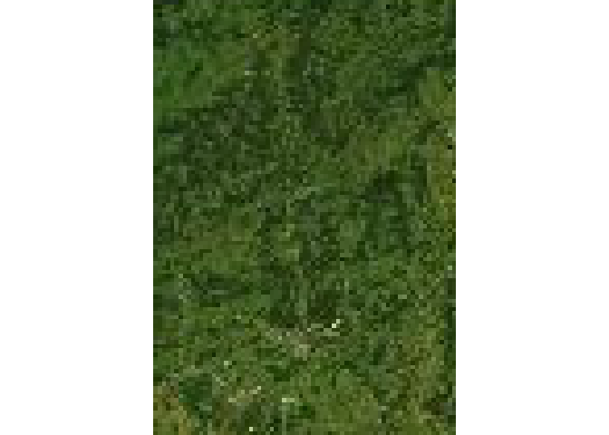
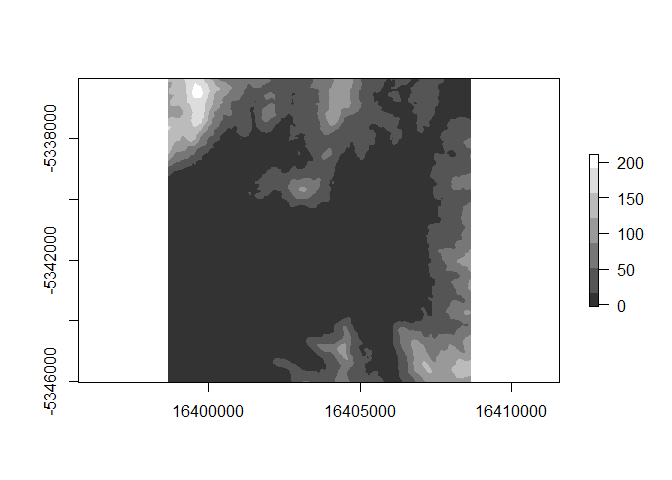

<!-- README.md is generated from README.Rmd. Please edit that file -->

[](https://travis-ci.org/hypertidy/ceramic)
[](https://ci.appveyor.com/project/mdsumner/ceramic)
[](https://codecov.io/github/hypertidy/ceramic?branch=master)
[](https://cran.r-project.org/package=ceramic)[](https://cran.r-project.org/package=ceramic)

# ceramic

The goal of ceramic is to obtain web map tiles for later re-use. Many
tools for imagery services treat the imagery as transient, but here we
take control over the raw data itself.

# Goals

Very much WIP.

  - control download of raw tiles (we have this\!)
  - allow lazy read access to tile caches
  - generalize across providers
  - provide interactive means to build access to imagery

## Installation

You can install the development version of ceramic from Github.

``` r
devtools::install_github("hypertidy/ceramic")
```

Set your mapbox API key with

``` r
Sys.setenv(MAPBOX_API_KEY = "<yourkey>")
```

## Example

This complete example gets tiled imagery that we can use as real data.

The code here

  - generates a bounding box in longitude-latitude
  - uses [slippymath](https://github.com/MilesMcBain/slippymath/) to
    find sensible tiles for the region
  - downloads them to a local cache
  - georeferences them and merges the tiles into a sensible raster
    object

<!-- end list -->

``` r
library(ceramic)
## a point in longlat, and a buffer with in metres
pt <- cbind(136, -34)
im <- cc_location(pt, buffer = c(1e6, 5e5), type = "mapbox.satellite", debug = T)
#> [1] "/perm_storage/home/mdsumner/.cache/.ceramic/api.mapbox.com/v4/mapbox.satellite/6/54/37.jpg"
#> [1] "/perm_storage/home/mdsumner/.cache/.ceramic/api.mapbox.com/v4/mapbox.satellite/6/55/37.jpg"
#> [1] "/perm_storage/home/mdsumner/.cache/.ceramic/api.mapbox.com/v4/mapbox.satellite/6/56/37.jpg"
#> [1] "/perm_storage/home/mdsumner/.cache/.ceramic/api.mapbox.com/v4/mapbox.satellite/6/57/37.jpg"
#> [1] "/perm_storage/home/mdsumner/.cache/.ceramic/api.mapbox.com/v4/mapbox.satellite/6/54/38.jpg"
#> [1] "/perm_storage/home/mdsumner/.cache/.ceramic/api.mapbox.com/v4/mapbox.satellite/6/55/38.jpg"
#> [1] "/perm_storage/home/mdsumner/.cache/.ceramic/api.mapbox.com/v4/mapbox.satellite/6/56/38.jpg"
#> [1] "/perm_storage/home/mdsumner/.cache/.ceramic/api.mapbox.com/v4/mapbox.satellite/6/57/38.jpg"
#> [1] "/perm_storage/home/mdsumner/.cache/.ceramic/api.mapbox.com/v4/mapbox.satellite/6/54/39.jpg"
#> [1] "/perm_storage/home/mdsumner/.cache/.ceramic/api.mapbox.com/v4/mapbox.satellite/6/55/39.jpg"
#> [1] "/perm_storage/home/mdsumner/.cache/.ceramic/api.mapbox.com/v4/mapbox.satellite/6/56/39.jpg"
#> [1] "/perm_storage/home/mdsumner/.cache/.ceramic/api.mapbox.com/v4/mapbox.satellite/6/57/39.jpg"
library(raster)
#> Loading required package: sp
plotRGB(im)

## get the matching tiles (zoom is magic here, it's all wrapped - needs thought)

tiles <- ceramic_tiles(zoom = 6, type = "mapbox.satellite")
library(sf)
#> Linking to GEOS 3.7.0, GDAL 2.4.0, PROJ 5.2.0
plot(st_geometry(ceramic:::tiles_to_polygon(tiles)), add = TRUE)
middle <- function(x, y) {
  x + (y - x)/2
}
text(middle(tiles$xmin, tiles$xmax), middle(tiles$ymin, tiles$ymax), lab = sprintf("[%i,%i]", tiles$tile_x, tiles$tile_y), 
     col = "firebrick")
```


## Input a spatial object

We can use raster, sp, or sf objects to define an extent. Use
`max_tiles` or `zoom` to increase or decrease resolution.

``` r
lux <- spex::lux

im1 <- cc_location(lux, debug = TRUE)
#> [1] "/perm_storage/home/mdsumner/.cache/.ceramic/api.mapbox.com/v4/mapbox.satellite/10/528/346.jpg"
#> [1] "/perm_storage/home/mdsumner/.cache/.ceramic/api.mapbox.com/v4/mapbox.satellite/10/529/346.jpg"
#> [1] "/perm_storage/home/mdsumner/.cache/.ceramic/api.mapbox.com/v4/mapbox.satellite/10/530/346.jpg"
#> [1] "/perm_storage/home/mdsumner/.cache/.ceramic/api.mapbox.com/v4/mapbox.satellite/10/528/347.jpg"
#> [1] "/perm_storage/home/mdsumner/.cache/.ceramic/api.mapbox.com/v4/mapbox.satellite/10/529/347.jpg"
#> [1] "/perm_storage/home/mdsumner/.cache/.ceramic/api.mapbox.com/v4/mapbox.satellite/10/530/347.jpg"
#> [1] "/perm_storage/home/mdsumner/.cache/.ceramic/api.mapbox.com/v4/mapbox.satellite/10/528/348.jpg"
#> [1] "/perm_storage/home/mdsumner/.cache/.ceramic/api.mapbox.com/v4/mapbox.satellite/10/529/348.jpg"
#> [1] "/perm_storage/home/mdsumner/.cache/.ceramic/api.mapbox.com/v4/mapbox.satellite/10/530/348.jpg"
#> [1] "/perm_storage/home/mdsumner/.cache/.ceramic/api.mapbox.com/v4/mapbox.satellite/10/528/349.jpg"
#> [1] "/perm_storage/home/mdsumner/.cache/.ceramic/api.mapbox.com/v4/mapbox.satellite/10/529/349.jpg"
#> [1] "/perm_storage/home/mdsumner/.cache/.ceramic/api.mapbox.com/v4/mapbox.satellite/10/530/349.jpg"
im2 <- cc_location(raster(lux), zoom = 7)
plotRGB(im1); plot(sp::spTransform(lux, projection(im1)), add = TRUE, border = "white")
```


``` r
plotRGB(im2)
```



``` r
## objects with different projections can also be used
plux <- sp::spTransform(lux, "+proj=laea +lon_0=5")
im3 <- cc_location(plux)  ## same as im1
```

There is a helper function to find existing
tiles.

``` r
aa <- cc_location(loc = cbind(0, 0), buffer = 330000, type = "mapbox.satellite")
ceramic_tiles(zoom = 7, type = "mapbox.satellite")
#> # A tibble: 17 x 11
#>    tile_x tile_y  zoom type  version source
#>     <int>  <int> <int> <chr> <chr>   <chr> 
#>  1     62     62     7 mapb… v4      api.m…
#>  2     62     63     7 mapb… v4      api.m…
#>  3     62     64     7 mapb… v4      api.m…
#>  4     62     65     7 mapb… v4      api.m…
#>  5     63     62     7 mapb… v4      api.m…
#>  6     63     63     7 mapb… v4      api.m…
#>  7     63     64     7 mapb… v4      api.m…
#>  8     63     65     7 mapb… v4      api.m…
#>  9     64     62     7 mapb… v4      api.m…
#> 10     64     63     7 mapb… v4      api.m…
#> 11     64     64     7 mapb… v4      api.m…
#> 12     64     65     7 mapb… v4      api.m…
#> 13     65     62     7 mapb… v4      api.m…
#> 14     65     63     7 mapb… v4      api.m…
#> 15     65     64     7 mapb… v4      api.m…
#> 16     65     65     7 mapb… v4      api.m…
#> 17     66     43     7 mapb… v4      api.m…
#> # … with 5 more variables: fullname <fs::path>, xmin <dbl>, xmax <dbl>,
#> #   ymin <dbl>, ymax <dbl>
```

and every row has the extent values useable directly by raster:

``` r
ceramic_tiles(zoom = 7, type = "mapbox.satellite") %>% 
  dplyr::slice(1:5) %>% 
   purrr::transpose()  %>% 
  purrr::map(~raster::extent(unlist(.x[c("xmin", "xmax", "ymin", "ymax")])))
#> [[1]]
#> class       : Extent 
#> xmin        : -626172.1 
#> xmax        : -313086.1 
#> ymin        : 313086.1 
#> ymax        : 626172.1 
#> 
#> [[2]]
#> class       : Extent 
#> xmin        : -626172.1 
#> xmax        : -313086.1 
#> ymin        : 0 
#> ymax        : 313086.1 
#> 
#> [[3]]
#> class       : Extent 
#> xmin        : -626172.1 
#> xmax        : -313086.1 
#> ymin        : -313086.1 
#> ymax        : 0 
#> 
#> [[4]]
#> class       : Extent 
#> xmin        : -626172.1 
#> xmax        : -313086.1 
#> ymin        : -626172.1 
#> ymax        : -313086.1 
#> 
#> [[5]]
#> class       : Extent 
#> xmin        : -313086.1 
#> xmax        : 0 
#> ymin        : 313086.1 
#> ymax        : 626172.1
```

Another example

``` r
my_bbox <-
  st_bbox(c(xmin = 144,
            xmax = 147.99,
            ymin = -44.12,
            ymax = -40),
          crs = st_crs("+proj=longlat +ellps=WGS84"))
im <- cc_location(cbind(145.5, -42.2), buffer = 5e5)
plotRGB(im)
plot(st_transform(ozmaps::abs_lga$geometry, projection(im)), add = TRUE, lwd = 2, border = "white")
```


An internal function sets up a plot of tiles at particular zoom levels.

``` r
ceramic::plot_tiles(ceramic_tiles(zoom = c(7, 9)))
```


And we can add the tiles to an existing plot.

``` r
plotRGB(im)
ceramic::plot_tiles(ceramic_tiles(zoom = 7), add = TRUE)
```


## Address helper

``` r
## DEPENDS ON Sys.getenv("OPENCAGE_KEY")
get_address <- function(address) {
  x <- opencage::opencage_forward(address, no_annotations = T, no_dedupe = T)
  
  cbind(x$results$geometry.lng[1], x$results$geometry.lat[1])
}
```

rgb helper

``` r
values_to_hex <- function(x) {
  rgb(x[,1], x[,2], x[, 3], max = 255)
}
raster_to_hex <- function(x) {
  values_to_hex(raster::values(x))
}
quadmesh_to_tex <- function(x, im) {
  xy_to_tex(t(x$vb[1:2, ]), im)
}
xy_to_tex <- function(xy, im) {
  xyFromCell(setExtent(im, extent(0, 1, 0, 1)), 
             cellFromXY(im, xy))  ## must be the same projection
}
```

# Textures

See `quadmesh::quadmesh`.

## Elevation

Get DEM, get image, make a scene.

``` r

loc <- cbind(147.3565, -43.19052)
dem <- cc_elevation(loc)
zap0 <- function(x) x[x > 0]
plot(dem, col = grey(seq(0.2, 1, length.out =  7)))
```



``` r


#library(quadmesh)  # @textures branch

#qm <- quadmesh(dem, texture = cc_location(loc, type = "mapbox.satellite"))
#library(rgl)
#shade3d(qm); rglwidget()
```

Please note that the ‘ceramic’ project is released with a [Contributor
Code of Conduct](CODE_OF_CONDUCT.md). By contributing to this project,
you agree to abide by its terms.
