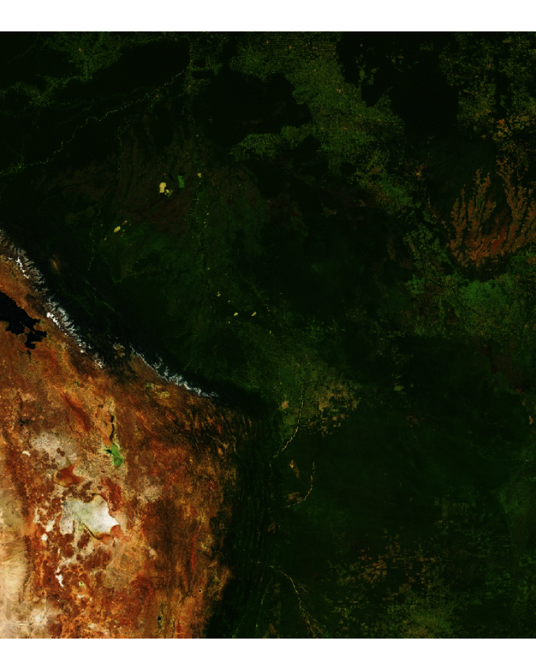

<!-- README.md is generated from README.Rmd. Please edit that file -->
<!-- badges: start -->

[](https://github.com/hypertidy/ceramic/actions/workflows/R-CMD-check.yaml)
<!-- badges: end -->

# ceramic

The goal of ceramic is to obtain web map tiles. Use a spatial object to
define the region of interest.

``` r
library(ceramic)
#> Loading required package: terra
#> terra 1.7.23
roi <- ext(100, 160, -50, 10)
im <- cc_location(roi)

plotRGB(im)
```


The terra package is always loaded by ceramic, so we can assume the use
of its functions, ceramic accepts a wider range of inputs than terra
does however.

We can use wk, geos, terra, raster, sp, sf, or stars objects, or an
input lon,lat point and a buffer (in metres) to define an extent. This
provides a very easy way to obtain imagery or elevation data for any
almost any region using our own data.

``` r
sql <- "SELECT shapeGroup FROM geoBoundariesCGAZ_ADM0 WHERE shapeGroup IN ('BOL')"
dsn <- "/vsizip//vsicurl/https://github.com/wmgeolab/geoBoundaries/raw/main/releaseData/CGAZ/geoBoundariesCGAZ_ADM0.zip"
bol <- vect(dsn, query = sql)

im <- cc_location(bol)
plotRGB(im)
```



Even if the data uses a map projection it will be converted into a
region to match the Mercator extents used by Mapbox image servers.

There are basic heuristics to decide if data is projected or just in
“longitude,latitude” in the usual way.

Raster elevation data is also available.

``` r
north <- nz[nz$Island == "North", ]
dem_nz <- cc_elevation(north, type = "elevation-tiles-prod" )


## plot elevation data for NZ north
dem_nz[!dem_nz > 0] <- NA

plot(dem_nz, col = grey.colors(128))
plot(st_transform(st_cast(north, "MULTILINESTRING")["Name"], terra::crs(dem_nz)), add = TRUE, lwd = 5)
```


## I thought you said *tiles*?

Indeed, here’s a function called `read_tiles()`, it shares the same
interface as `get_tiles()`.

``` r
read_tiles()
#> Preparing to download: 1 tiles at zoom = 0 from 
#> https://api.mapbox.com/v4/mapbox.satellite/
#> class       : SpatRaster 
#> dimensions  : 256, 256, 3  (nrow, ncol, nlyr)
#> resolution  : 156543, 156543  (x, y)
#> extent      : -20037508, 20037508, -20037508, 20037508  (xmin, xmax, ymin, ymax)
#> coord. ref. : +proj=merc +lon_0=0 +k=1 +x_0=0 +y_0=0 +R=6378137 +units=m +no_defs 
#> source      : 0.jpg 
#> colors RGB  : 1, 2, 3 
#> names       : 0_1, 0_2, 0_3
```

Note that, the `cc_location()` and `cc_elevation()` functions no longer
use tiles, they read directly from the internet using GDAL and are not
related to the tile download facilities.

But, they used to run `get_tiles()` behind the scenes. The separation is
still a little unfinished, but I want ceramic to have separation of
loading data from the internet with downloading tiles.

This function and its counterparts `get_tiles_zoom()`, `get_tiles_dim()`
and `get_tiles_buffer()` will *only download files*.

``` r
tile_summ <- get_tiles_zoom(north, zoom = 8)
#> Preparing to download: 48 tiles at zoom = 8 from 
#> https://api.mapbox.com/v4/mapbox.satellite/
length(tile_summ$files)
#> [1] 48
str(tile_summ$tiles)
#> List of 2
#>  $ tiles:'data.frame':   48 obs. of  2 variables:
#>   ..$ x: int [1:48] 250 251 252 253 254 255 250 251 252 253 ...
#>   ..$ y: int [1:48] 153 153 153 153 153 153 154 154 154 154 ...
#>   ..- attr(*, "out.attrs")=List of 2
#>   .. ..$ dim     : Named int [1:2] 6 8
#>   .. .. ..- attr(*, "names")= chr [1:2] "x" "y"
#>   .. ..$ dimnames:List of 2
#>   .. .. ..$ x: chr [1:6] "x=250" "x=251" "x=252" "x=253" ...
#>   .. .. ..$ y: chr [1:8] "y=153" "y=154" "y=155" "y=156" ...
#>  $ zoom : num 8
#>  - attr(*, "class")= chr "tile_grid"

(tile_rect <- tiles_to_polygon(ceramic_tiles(zoom = 8)))
#> <wk_rct[78] with CRS=EPSG:3857>
#>  [1] [15028131 -3600490 15184674 -3443947] [15028131 -3757033 15184674 -3600490]
#>  [3] [15028131 -3913576 15184674 -3757033] [15028131 -4070119 15184674 -3913576]
#>  [5] [15028131 -4226662 15184674 -4070119] [15028131 -4383205 15184674 -4226662]
#>  [7] [15028131 -4539748 15184674 -4383205] [15184674 -3600490 15341217 -3443947]
#>  [9] [15184674 -3757033 15341217 -3600490] [15184674 -3913576 15341217 -3757033]
#> [11] [15184674 -4070119 15341217 -3913576] [15184674 -4226662 15341217 -4070119]
#> [13] [15184674 -4383205 15341217 -4226662] [15184674 -4539748 15341217 -4383205]
#> [15] [15967389 -4539748 16123932 -4383205] [15967389 -4696291 16123932 -4539748]
#> [17] [15967389 -4852834 16123932 -4696291] [16123932 -4539748 16280476 -4383205]
#> [19] [16123932 -4696291 16280476 -4539748] [16123932 -4852834 16280476 -4696291]
#> [21] [16123932 -5009377 16280476 -4852834] [16123932 -5165920 16280476 -5009377]
#> [23] [16280476 -4539748 16437019 -4383205] [16280476 -4696291 16437019 -4539748]
#> [25] [16280476 -4852834 16437019 -4696291] [16280476 -5009377 16437019 -4852834]
#> [27] [16280476 -5165920 16437019 -5009377] [16437019 -4852834 16593562 -4696291]
#> [29] [16437019 -5009377 16593562 -4852834] [16437019 -5165920 16593562 -5009377]
#> [31] [19098250 -4070119 19254793 -3913576] [19098250 -4226662 19254793 -4070119]
#> [33] [19098250 -4383205 19254793 -4226662] [19098250 -4539748 19254793 -4383205]
#> [35] [19098250 -4696291 19254793 -4539748] [19098250 -4852834 19254793 -4696291]
#> [37] [19098250 -5009377 19254793 -4852834] [19098250 -5165920 19254793 -5009377]
#> [39] [19254793 -4070119 19411336 -3913576] [19254793 -4226662 19411336 -4070119]
#> [41] [19254793 -4383205 19411336 -4226662] [19254793 -4539748 19411336 -4383205]
#> [43] [19254793 -4696291 19411336 -4539748] [19254793 -4852834 19411336 -4696291]
#> [45] [19254793 -5009377 19411336 -4852834] [19254793 -5165920 19411336 -5009377]
#> [47] [19411336 -4070119 19567879 -3913576] [19411336 -4226662 19567879 -4070119]
#> [49] [19411336 -4383205 19567879 -4226662] [19411336 -4539748 19567879 -4383205]
#> [51] [19411336 -4696291 19567879 -4539748] [19411336 -4852834 19567879 -4696291]
#> [53] [19411336 -5009377 19567879 -4852834] [19411336 -5165920 19567879 -5009377]
#> [55] [19567879 -4070119 19724422 -3913576] [19567879 -4226662 19724422 -4070119]
#> [57] [19567879 -4383205 19724422 -4226662] [19567879 -4539748 19724422 -4383205]
#> [59] [19567879 -4696291 19724422 -4539748] [19567879 -4852834 19724422 -4696291]
#> [61] [19567879 -5009377 19724422 -4852834] [19567879 -5165920 19724422 -5009377]
#> [63] [19724422 -4070119 19880965 -3913576] [19724422 -4226662 19880965 -4070119]
#> [65] [19724422 -4383205 19880965 -4226662] [19724422 -4539748 19880965 -4383205]
#> [67] [19724422 -4696291 19880965 -4539748] [19724422 -4852834 19880965 -4696291]
#> [69] [19724422 -5009377 19880965 -4852834] [19724422 -5165920 19880965 -5009377]
#> [71] [19880965 -4070119 20037508 -3913576] [19880965 -4226662 20037508 -4070119]
#> [73] [19880965 -4383205 20037508 -4226662] [19880965 -4539748 20037508 -4383205]
#> [75] [19880965 -4696291 20037508 -4539748] [19880965 -4852834 20037508 -4696291]
#> [77] [19880965 -5009377 20037508 -4852834] [19880965 -5165920 20037508 -5009377]
```

This is really for expert use when you want to control the downloaded
tile files yourself directly.

## Providers

The default map provider is [Mapbox](https://www.mapbox.com/), but
ceramic is written for general usage and also provides access to the
[joerd AWS tiles](https://github.com/tilezen/joerd/) via the
`type = "elevation-tiles-prod"` argument.

``` r
pt <- cbind(175.6082, -37.994)
nz_z12 <- cc_location(pt, buffer  = 100000,  type = "elevation-tiles-prod")
```

## Installation

Install ceramic from CRAN with:

``` r
install.packages("ceramic")
```

You can install the development version of ceramic from Github.

``` r
## install.packages("remotes")
remotes::install_github("hypertidy/ceramic")
```

Set your mapbox API key with

``` r
Sys.setenv(MAPBOX_API_KEY = "<yourkey>")
```

## Example

This complete example gets tiled imagery that we can use as real data.

The code here

- generates a bounding box in longitude-latitude
- reads the raster data using GDAL

then we look at the actual tiles involved,

- uses [slippymath](https://CRAN.r-project.org/package=slippymath) to
  find sensible tiles for the region
- downloads them to a local cache
- summarizes the tiles as a spatial (wk) object

``` r
library(ceramic)
## a point in longlat, and a buffer with in metres
pt <- cbind(136, -34)
im <- cc_location(pt, buffer = c(1e6, 5e5), type = "mapbox.satellite")
op <- par(bg = "black")
plotRGB(im)

## get the approximately matching tiles (zoom is magic here, it's all wrapped - needs thought)

tileset <- get_tiles(pt, buffer = c(1e6, 5e5))
#> Preparing to download: 28 tiles at zoom = 7 from 
#> https://api.mapbox.com/v4/mapbox.satellite/
tiles <- ceramic_tiles(zoom = tileset$tiles$zoom, type = "mapbox.satellite")
plot(tiles_to_polygon(tiles), add = TRUE, border = "white")


middle <- function(x, y) {
  x + (y - x)/2
}
text(middle(tiles$xmin, tiles$xmax), middle(tiles$ymin, tiles$ymax), lab = sprintf("[%i,%i]", tiles$tile_x, tiles$tile_y), 
     col = "yellow")
```


``` r
     
par(op)
```

------------------------------------------------------------------------

Please note that the ‘ceramic’ project is released with a [Contributor
Code of
Conduct](https://github.com/hypertidy/ceramic/blob/master/CODE_OF_CONDUCT.md).
By contributing to this project, you agree to abide by its terms.
