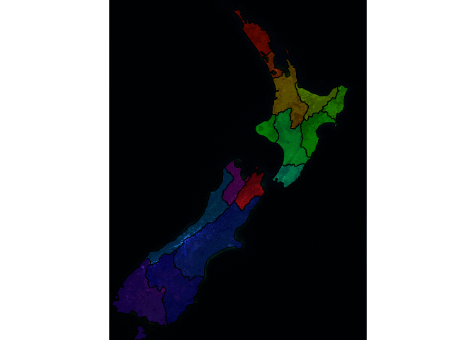

<!-- README.md is generated from README.Rmd. Please edit that file -->

[](https://www.tidyverse.org/lifecycle/#maturing)[](https://travis-ci.org/hypertidy/ceramic)
[](https://ci.appveyor.com/project/mdsumner/ceramic)
[](https://codecov.io/github/hypertidy/ceramic?branch=master)
[](https://cran.r-project.org/package=ceramic)[](https://cran.r-project.org/package=ceramic)

# ceramic

The goal of ceramic is to obtain web map tiles from Mapbox. Use a
spatial object to define the region of interest.

``` r
library(ceramic)
roi <- raster::extent(100, 160, -50, 10)
(im <- cc_location(roi))
#> Warning in raster::couldBeLonLat(loc): CRS is NA. Assuming it is longitude/
#> latitude
#> class       : RasterBrick 
#> dimensions  : 774, 684, 529416, 3  (nrow, ncol, ncell, nlayers)
#> resolution  : 9783.94, 9783.94  (x, y)
#> extent      : 11124339, 17816554, -6056259, 1516511  (xmin, xmax, ymin, ymax)
#> coord. ref. : +proj=merc +a=6378137 +b=6378137 
#> data source : in memory
#> names       : layer.1, layer.2, layer.3 
#> min values  :       0,       0,       0 
#> max values  :     255,     253,     227

raster::plotRGB(im)
```


We can use raster, sp, or sf objects to define an extent. This provides
a very easy way to obtain imagery or elevation data for any almost any
region using our own data.

``` r
ne <- rnaturalearth::ne_countries(returnclass = "sf")
im_nz <- cc_location(subset(ne, name == "New Zealand"))
raster::plotRGB(im_nz)
```


Even if the data uses a map projection it will be converted into a
region to match the Mercator extents used by Mapbox image servers.

``` r
data("nz", package = "spData")
library(sf)
#> Linking to GEOS 3.7.0, GDAL 2.4.0, PROJ 5.2.0
im_nz2 <- cc_location(nz)
raster::plotRGB(im_nz2)
plot(st_transform(nz, raster::projection(im_nz2)), add = TRUE, col = rainbow(nrow(nz), alpha = 0.5))
#> Warning in plot.sf(st_transform(nz, raster::projection(im_nz2)), add =
#> TRUE, : ignoring all but the first attribute
```



Raster elevation data is also available.

``` r
north <- nz[nz$Island == "North", ]
dem_nz <- cc_elevation(north)


## plot elevation data for NZ north
dem_nz[!dem_nz > 0] <- NA
raster::plot(dem_nz, col = grey(seq(0, 1, length = 51)), breaks = quantile(raster::values(dem_nz), seq(0, 1, length = 52), na.rm = TRUE), legend = FALSE)
plot(st_transform(st_cast(north, "MULTILINESTRING")["Name"], raster::projection(dem_nz)), add = TRUE, lwd = 5)
```


Use `max_tiles` or `zoom` to increase or decrease resolution.

``` r
im1 <- cc_location(im_nz, debug = TRUE)
#> [1] "/perm_storage/home/mdsumner/.cache/.ceramic/api.mapbox.com/v4/mapbox.satellite/6/61/38.jpg"
#> [1] "/perm_storage/home/mdsumner/.cache/.ceramic/api.mapbox.com/v4/mapbox.satellite/6/62/38.jpg"
#> [1] "/perm_storage/home/mdsumner/.cache/.ceramic/api.mapbox.com/v4/mapbox.satellite/6/63/38.jpg"
#> [1] "/perm_storage/home/mdsumner/.cache/.ceramic/api.mapbox.com/v4/mapbox.satellite/6/61/39.jpg"
#> [1] "/perm_storage/home/mdsumner/.cache/.ceramic/api.mapbox.com/v4/mapbox.satellite/6/62/39.jpg"
#> [1] "/perm_storage/home/mdsumner/.cache/.ceramic/api.mapbox.com/v4/mapbox.satellite/6/63/39.jpg"
#> [1] "/perm_storage/home/mdsumner/.cache/.ceramic/api.mapbox.com/v4/mapbox.satellite/6/61/40.jpg"
#> [1] "/perm_storage/home/mdsumner/.cache/.ceramic/api.mapbox.com/v4/mapbox.satellite/6/62/40.jpg"
#> [1] "/perm_storage/home/mdsumner/.cache/.ceramic/api.mapbox.com/v4/mapbox.satellite/6/63/40.jpg"
#> [1] "/perm_storage/home/mdsumner/.cache/.ceramic/api.mapbox.com/v4/mapbox.satellite/6/61/41.jpg"
#> [1] "/perm_storage/home/mdsumner/.cache/.ceramic/api.mapbox.com/v4/mapbox.satellite/6/62/41.jpg"
#> [1] "/perm_storage/home/mdsumner/.cache/.ceramic/api.mapbox.com/v4/mapbox.satellite/6/63/41.jpg"
im2 <- cc_location(im_nz, zoom = 7)

im1
#> class       : RasterBrick 
#> dimensions  : 736, 548, 403328, 3  (nrow, ncol, ncell, nlayers)
#> resolution  : 2445.985, 2445.985  (x, y)
#> extent      : 18533228, 19873627, -5845904, -4045659  (xmin, xmax, ymin, ymax)
#> coord. ref. : +proj=merc +a=6378137 +b=6378137 
#> data source : in memory
#> names       : layer.1, layer.2, layer.3 
#> min values  :       0,       4,       0 
#> max values  :     255,     255,     255

im2
#> class       : RasterBrick 
#> dimensions  : 1470, 1095, 1609650, 3  (nrow, ncol, ncell, nlayers)
#> resolution  : 1222.992, 1222.992  (x, y)
#> extent      : 18534451, 19873627, -5844681, -4046882  (xmin, xmax, ymin, ymax)
#> coord. ref. : +proj=merc +a=6378137 +b=6378137 
#> data source : in memory
#> names       : layer.1, layer.2, layer.3 
#> min values  :       0,       5,       0 
#> max values  :     255,     255,     255
```

## Installation

You can install the development version of ceramic from Github.

``` r
devtools::install_github("hypertidy/ceramic")
```

Set your mapbox API key with

``` r
Sys.setenv(MAPBOX_API_KEY = "<yourkey>")
```

## Example

This complete example gets tiled imagery that we can use as real data.

The code here

  - generates a bounding box in longitude-latitude
  - uses [slippymath](https://github.com/MilesMcBain/slippymath/) to
    find sensible tiles for the region
  - downloads them to a local cache
  - georeferences them and merges the tiles into a sensible raster
    object

<!-- end list -->

``` r
library(ceramic)
## a point in longlat, and a buffer with in metres
pt <- cbind(136, -34)
im <- cc_location(pt, buffer = c(1e6, 5e5), type = "mapbox.satellite", debug = T)
#> [1] "/perm_storage/home/mdsumner/.cache/.ceramic/api.mapbox.com/v4/mapbox.satellite/6/54/37.jpg"
#> [1] "/perm_storage/home/mdsumner/.cache/.ceramic/api.mapbox.com/v4/mapbox.satellite/6/55/37.jpg"
#> [1] "/perm_storage/home/mdsumner/.cache/.ceramic/api.mapbox.com/v4/mapbox.satellite/6/56/37.jpg"
#> [1] "/perm_storage/home/mdsumner/.cache/.ceramic/api.mapbox.com/v4/mapbox.satellite/6/57/37.jpg"
#> [1] "/perm_storage/home/mdsumner/.cache/.ceramic/api.mapbox.com/v4/mapbox.satellite/6/54/38.jpg"
#> [1] "/perm_storage/home/mdsumner/.cache/.ceramic/api.mapbox.com/v4/mapbox.satellite/6/55/38.jpg"
#> [1] "/perm_storage/home/mdsumner/.cache/.ceramic/api.mapbox.com/v4/mapbox.satellite/6/56/38.jpg"
#> [1] "/perm_storage/home/mdsumner/.cache/.ceramic/api.mapbox.com/v4/mapbox.satellite/6/57/38.jpg"
#> [1] "/perm_storage/home/mdsumner/.cache/.ceramic/api.mapbox.com/v4/mapbox.satellite/6/54/39.jpg"
#> [1] "/perm_storage/home/mdsumner/.cache/.ceramic/api.mapbox.com/v4/mapbox.satellite/6/55/39.jpg"
#> [1] "/perm_storage/home/mdsumner/.cache/.ceramic/api.mapbox.com/v4/mapbox.satellite/6/56/39.jpg"
#> [1] "/perm_storage/home/mdsumner/.cache/.ceramic/api.mapbox.com/v4/mapbox.satellite/6/57/39.jpg"
library(raster)
#> Loading required package: sp
plotRGB(im)

## get the matching tiles (zoom is magic here, it's all wrapped - needs thought)

tiles <- ceramic_tiles(zoom = 6, type = "mapbox.satellite")
library(sf)
plot(st_geometry(ceramic:::tiles_to_polygon(tiles)), add = TRUE)
middle <- function(x, y) {
  x + (y - x)/2
}
text(middle(tiles$xmin, tiles$xmax), middle(tiles$ymin, tiles$ymax), lab = sprintf("[%i,%i]", tiles$tile_x, tiles$tile_y), 
     col = "firebrick")
```


## Local caching of tiles

A key feature of ceramic is *caching*, all data is downloaded in a
systematic way that is suitable for later re-use. Many tools for imagery
services treat the imagery as transient, but here we take control over
the raw data itself. All file names match exactly the address URL of the
original source data.

There is a helper function to find existing
tiles.

``` r
aa <- cc_location(loc = cbind(0, 0), buffer = 330000, type = "mapbox.satellite")
ceramic_tiles(zoom = 7, type = "mapbox.satellite")
#> # A tibble: 60 x 11
#>    tile_x tile_y  zoom type  version source
#>     <int>  <int> <int> <chr> <chr>   <chr> 
#>  1    123     76     7 mapb… v4      api.m…
#>  2    123     77     7 mapb… v4      api.m…
#>  3    123     78     7 mapb… v4      api.m…
#>  4    123     79     7 mapb… v4      api.m…
#>  5    123     80     7 mapb… v4      api.m…
#>  6    123     81     7 mapb… v4      api.m…
#>  7    123     82     7 mapb… v4      api.m…
#>  8    124     76     7 mapb… v4      api.m…
#>  9    124     77     7 mapb… v4      api.m…
#> 10    124     78     7 mapb… v4      api.m…
#> # … with 50 more rows, and 5 more variables: fullname <fs::path>,
#> #   xmin <dbl>, xmax <dbl>, ymin <dbl>, ymax <dbl>
```

and every row has the extent values useable directly by raster:

``` r
ceramic_tiles(zoom = 7, type = "mapbox.satellite") %>% 
  dplyr::slice(1:5) %>% 
   purrr::transpose()  %>% 
  purrr::map(~raster::extent(unlist(.x[c("xmin", "xmax", "ymin", "ymax")])))
#> [[1]]
#> class       : Extent 
#> xmin        : 18472078 
#> xmax        : 18785164 
#> ymin        : -4070119 
#> ymax        : -3757033 
#> 
#> [[2]]
#> class       : Extent 
#> xmin        : 18472078 
#> xmax        : 18785164 
#> ymin        : -4383205 
#> ymax        : -4070119 
#> 
#> [[3]]
#> class       : Extent 
#> xmin        : 18472078 
#> xmax        : 18785164 
#> ymin        : -4696291 
#> ymax        : -4383205 
#> 
#> [[4]]
#> class       : Extent 
#> xmin        : 18472078 
#> xmax        : 18785164 
#> ymin        : -5009377 
#> ymax        : -4696291 
#> 
#> [[5]]
#> class       : Extent 
#> xmin        : 18472078 
#> xmax        : 18785164 
#> ymin        : -5322463 
#> ymax        : -5009377
```

Another example

``` r
my_bbox <-
  st_bbox(c(xmin = 144,
            xmax = 147.99,
            ymin = -44.12,
            ymax = -40),
          crs = st_crs("+proj=longlat +ellps=WGS84"))
im <- cc_location(cbind(145.5, -42.2), buffer = 5e5)
plotRGB(im)
plot(st_transform(ozmaps::abs_lga$geometry, projection(im)), add = TRUE, lwd = 2, border = "white")
```


An internal function sets up a plot of tiles at particular zoom levels.

``` r
ceramic::plot_tiles(ceramic_tiles(zoom = c(7, 9)))
```


And we can add the tiles to an existing plot.

``` r
plotRGB(im)
ceramic::plot_tiles(ceramic_tiles(zoom = 7), add = TRUE)
```


## Address helper

``` r
## DEPENDS ON Sys.getenv("OPENCAGE_KEY")
get_address <- function(address) {
  x <- opencage::opencage_forward(address, no_annotations = T, no_dedupe = T)
  
  cbind(x$results$geometry.lng[1], x$results$geometry.lat[1])
}
```

rgb helper

``` r
values_to_hex <- function(x) {
  rgb(x[,1], x[,2], x[, 3], max = 255)
}
raster_to_hex <- function(x) {
  values_to_hex(raster::values(x))
}
quadmesh_to_tex <- function(x, im) {
  xy_to_tex(t(x$vb[1:2, ]), im)
}
xy_to_tex <- function(xy, im) {
  xyFromCell(setExtent(im, extent(0, 1, 0, 1)), 
             cellFromXY(im, xy))  ## must be the same projection
}
```

# Textures

See `quadmesh::quadmesh`.

## Elevation

Get DEM, get image, make a scene.

``` r

loc <- cbind(147.3565, -43.19052)
dem <- cc_elevation(loc)
zap0 <- function(x) x[x > 0]
plot(dem, col = grey(seq(0.2, 1, length.out =  7)))
```


``` r


#library(quadmesh)  # @textures branch

#qm <- quadmesh(dem, texture = cc_location(loc, type = "mapbox.satellite"))
#library(rgl)
#shade3d(qm); rglwidget()
```

# Future improvements

  - control download of raw tiles (we have this\!)
  - allow lazy read access to tile caches
  - generalize across providers
  - provide interactive means to build access to imagery

Please note that the ‘ceramic’ project is released with a [Contributor
Code of Conduct](CODE_OF_CONDUCT.md). By contributing to this project,
you agree to abide by its terms.
